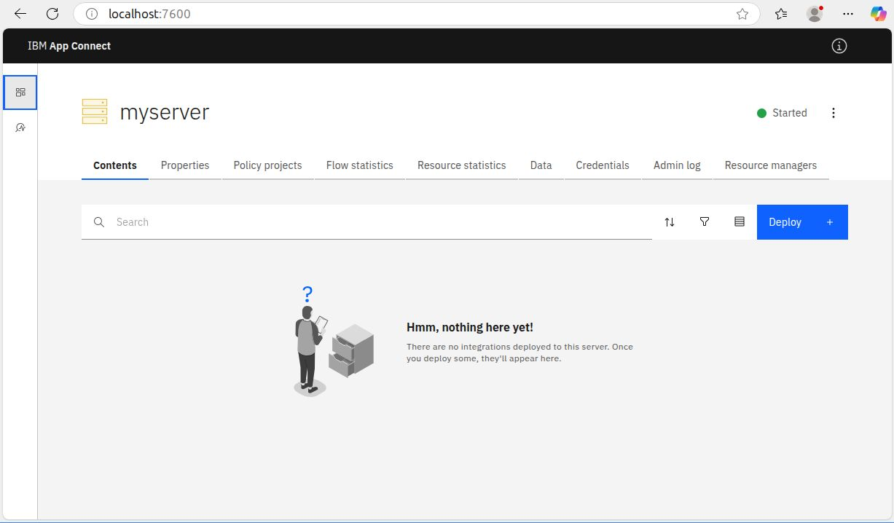

This Dockerfile is based on the source code of IBM's <a href="https://github.com/ot4i/ace-docker" target="_blank">ace-docker</a> project. This is an offline build, so the installer must be downloaded manually.

## Requirements

- Docker or Podman
- IBM App Connect Enterprise <a href="https://www.ibm.com/docs/en/app-connect/12.0.x?topic=enterprise-download-ace-developer-edition-get-started" target="_blank">Installer</a> (In this example, version 12.0.12.13 is used)

## Environment variables

#### ACE_INSTALLER_NAME

This variable is mandatory and specifies installer name of IBM ACE. The installer should be locate in the same directory as the Dockerfile.

#### ACE_VERSION

This variable is mandatory and specifies the version of IBM ACE. The version value is used to create the installation folder at /opt/ibm/ace/${ACE_VERSION}/.

## Building the image

If you are using Docker, simply replace the word podman with docker.

```
podman build --no-cache --tag ace-server:12.0.12.13 --file Dockerfile .
```

When the image has been built, get the image ID.

```
podman images
```

## Building the container

Replace 1a8624526e28 with the image ID obtained during the image build step.

```
podman run -p 7600:7600 -p 7800:7800 -e LICENSE=accept -e ACE_SERVER_NAME=myserver 1a8624526e28
```

## Server started


